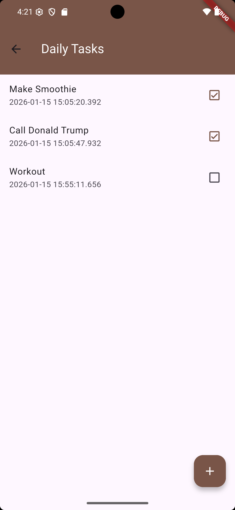
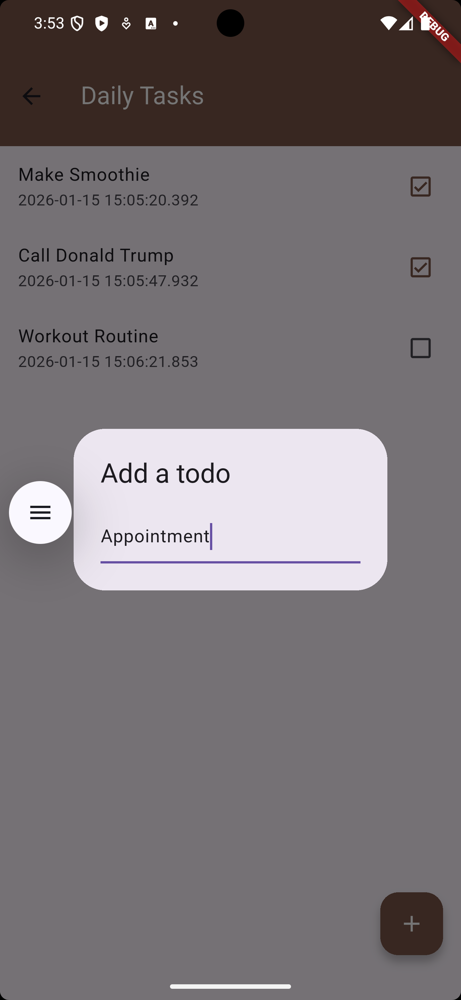
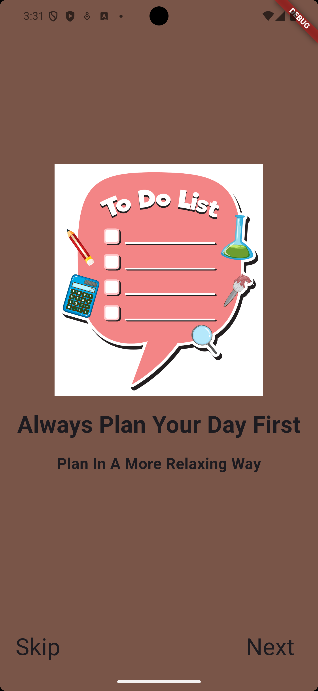
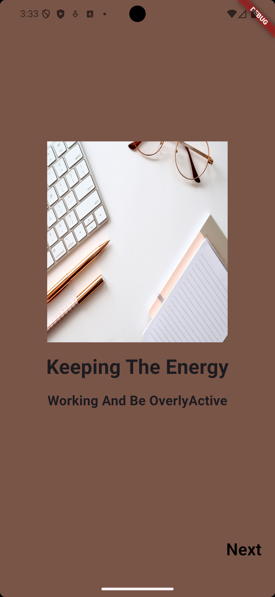
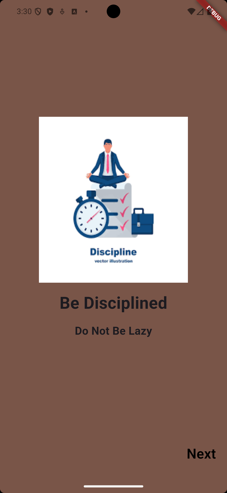

# Daily Task Planner App
This app allows the user to place a task they want to achieve at a specific time.

## 📸 Screenshots

| Section | Description | Screenshot |
|--------|-------------|------------|
| **Daily Task Page** | Displays available tasks. Users can add extra tasks, delete tasks, and mark completed tasks using a checkbox. |  |
| **Add Task Page** | Interface that allows the user to add a task they wish to achieve. |  |
| **Introduction Page 1** | First introduction screen shown to users before entering the main application. |  |
| **Introduction Page 2** | Second introduction screen providing more details about the application. |  |
| **Introduction Page 3** | Final introduction screen before accessing the main application. |  |
